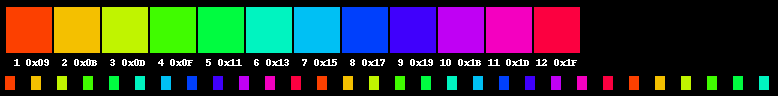

# Hex

Hex is an OSM firmware that loves the number 16.

## Features
* **16 Strobe Modes** to chose from
* **16 Modes** to customize
* **16 Color Slots** per mode
* **4 16 Slot Bundles** for custom mode playlists
* **62 Color Palette** (+ blank) with **4 Shades** to chose from
* Conjuring Mode

##  Installation

### Packaged release on Mac OS X

* Download [https://www.arduino.cc/en/Main/Software](Aduino 1.6.5) and install it to /Applications.
* Download the latest .dmg from the releases tab.
* Open the .dmg and double-click on "Upload .hex"

### Packaged release on Windows

* Download the latest .hex from the releases tab.
* Using XLoader, follow this tutorial on how to install.
  * Make sure to use 115200 for the speed.
  * Make sure to select "Uno(ATMega328)" from the Device dropdown.
  * Be sure to select the correct .hex file.

## Controls

**Off**
* Press - Turn on. Go to **Play**.
* Hold 1.5s - Go to **Bundle Select**. Flashes blue.

**Bundle Select**
* Press - Cycle bundle.
* Hold 1.5s - Selects current bundle. Go to **Play**. Flashes blue.
* Hold 3.0s - Go to **Bundle Edit**. Flashes yellow.

**Bundle Edit**
* Press - Cycle bundle slot to next mode.
* Hold 1.5s - Sets current bundle slot to selected mode. Cycles to next bundle slot. Flashes magenta.
* Hold 3.0s - Saves bundle with current bundle slot as the end of the bundle. Go to **Play**. Flashes white.

**Play (Normal Mode)**
* Press - Cycle to next mode.
* Hold 1.0s - Put light to sleep. Flashes white.
* Hold 2.5s - Enables **Conjure Mode**. Flashes blue.
* Hold 4.0s - Go to **Palette Config**. Flashes yellow.
* Hold 5.5s - Go to **Prime Config**. Flashes yellow.

**Play (Conjure Mode)**
* Press - Toggle light on/off (processor still running).
* Hold 1.0s - Turn off light and deactivate Conjure Mode. Flashes white.
* Hold 2.5s - Disable **Conjure Mode**. Flashes blue.
* Hold 4.0s - Go to **Config Select**. Flashes yellow.

**Palette Config**
* Press - Cycle forward through palette options.
* Dpress - Cycle backward through palette options.
* Hold 1.5s - Select color. Flashes white.
* Hold 1.5s more - Cycle to next shade. Flashes white.
* Release after hold - Go to **Confirm Color**.

**Confirm Color**
* Press - Accept color.
  * If last (12th) color slot, go to **Play** and save. Flashes white.
  * Otherwise just go to next color slot.
* Hold 1.5s - Reject color.
  * If first color slot, go to **Config Palette**. Flashes red.
  * Otherwise, go to **Confirm Color** for previous color slot. Flashes red.
* Hold 3.0s - Accept and save. Sets current color slot as last color. Go to **Play**. Flashes white.

**Prime Config**
* Press - Cycles to next prime.
* Hold 1.5s - Accept and save. Go to **Play**. Flashes white.

## Animations

### Strobe
5ms/8ms Strobe

* Hyper - 17ms/17ms Strobe
* Dops - 1ms/10ms Strobe
* Strobie - 3ms/23ms Strobe
* Pulse - 50ms Fade In and Out/25ms Off
* Seizure - 5ms Fade In/95ms Off
* Tracer - 3ms Color/23ms Color 1
* Dash Dops
  * 7ms Per Color for Color 2+
  * 7 1ms/10ms Strobes of Color 1
* Blink-E - 5ms Per Color/50ms Off
* Edge 
  * 2ms Per Color for Last Color to Color 2
  * 5ms Color 1
  * 2ms Per Color for Color 2 to Last Color
* Lego - 2, 8, or 16ms/8ms Random Strobe
* Chase 
  * 50ms Color A/10ms Off
  * 10ms Color B/10ms Off/30ms Color A/10ms Off
  * 20ms Color B/10ms Off/20ms Color A/10ms Off
  * 30ms Color B/10ms Off/10ms Color A/10ms Off
  * Repeat with B and next color...
* Morph - 17ms/17ms strobe where A morphs to B over 4 strobes
* Ribbon - 11ms per color
* Comet - 15ms/8ms Color time starts as 1 of 15ms and then increases and decreases before the color changes
* Candy - 5ms/8ms Strobe of first 3 colors for 3 cycles, then drop first color and add next
